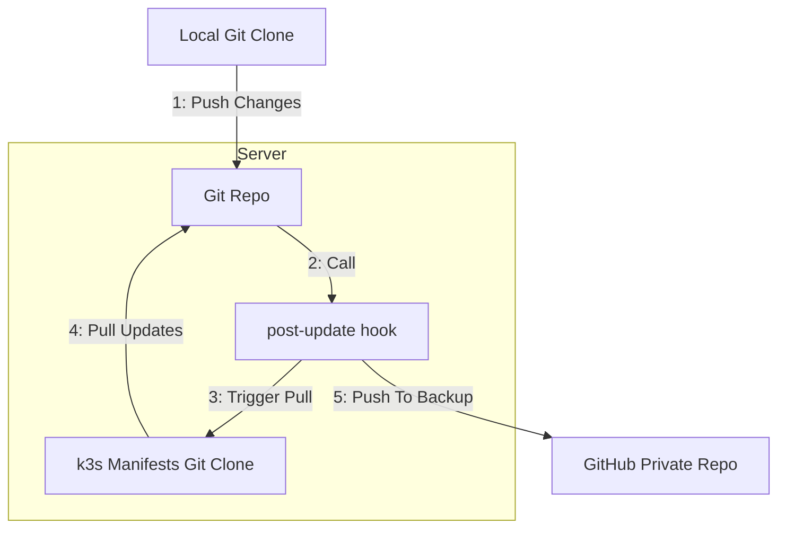

---
tags:
  - k3s
  - kubernetes
  - scripts
  - git
  - devops
---
> [!note]
> This post is part of my [[7 Days Of Kubernetes]] where I explore setting up [a cheap MiniPC](https://amzn.to/42tenCq) as a single-node Kubernetes cluster using k3s.


K3s supports [a "magic directory" that will automatically apply any manifests that are placed inside it.](https://docs.k3s.io/installation/packaged-components) We can use this directory along with [its support for helm charts](https://docs.k3s.io/helm) to quickly get our deploys up and running.

## Testing it Out

We can see how this works with a pretty simple test. Let's deploy a ConfigMap to the `default` namespace:

```bash
cat > /var/lib/rancher/k3s/server/manifests/test-k3s-configmap.yaml <<'EOF'
apiVersion: v1
kind: ConfigMap
metadata:
  name: test-k3s
  namespace: default
data:
  hello: world
EOF
```

We can then test to see if the configmap was created:

```bash
> k get configmap test-k3s -n default -o yaml

apiVersion: v1
data:
  hello: world
kind: ConfigMap
[... truncated ...]
```

Great! This works exactly as described!

## Automating the Deploy

It's helpful if we can have our configs in a git repo. It makes it easy to have a history of changes and it allows us to use our local development environment when writing manifests.

To do this, we'll start off simple by initializing a bare git repo on our root account and then pushing to that repo. We can have a `post-update` hook on that repo so that when we push to the master branch it auto-copies the files into the manifests directory.

In addition, we'll have the post-update hook push to a GitHub private repository so we have an extra backup.



One minor caveat on this: we don't want to have our git clone in the root of the manifests directory (e.g.: `/var/lib/rancher/k3s/server/manifests/`) but rather a subdirectory (e.g.: `/var/lib/rancher/k3s/server/manifests/custom`). This is because there are other manifests already in the manifests directory that we don't want to mess with.

## Setting it up

### 1. Initialize the Git Remote

We will initialize our git remote inside the home folder of the root user on our server. 

SSH into the server as root and initialize the repo:
```bash
ssh root@server -o RemoteCommand='git init --bare /root/k3s-manifests.git'
```

### 2. Clone down the remote

On your local machine, clone down your new git repo:

```bash
git clone "ssh://root@server:/root/k3s-manifests.git"
```

### 3. Configure your post-update hook

For the post-update hook we're going to get a bit clever. We'll create a generic script called "auto-actions.sh" which will allow us to store our post-update hook in our git repo as well. 

We'll then use a symlink to point the post-update hook at auto-actions.sh and finally add `.ci/post-update` to our git repo which will be triggered on push.

#### Create the auto-actions.sh script:

```
ssh root@server

# on the server...

# Define our filename
script_path=/root/k3s-manifests.git/hooks/auto-actions.sh

# make it executable
touch "$script_path" 

# make it executable
chmod 750 "$script_path" 

# Write the file content
cat > "$script_path" <<'EOF'
#!/usr/bin/env bash

set -euo pipefail

git_remote=$( readlink -f "$GIT_DIR" )

workdir=$( mktemp -d )
trap "rm -rf '$workdir';" EXIT # cleanup when we're done

ref=$( echo "$1" | cut -d/ -f3- )
GIT_DIR="" git clone --depth=1  -b "$ref" "file://$git_remote" "$workdir"

# This is the bit of magic that allows us to have our post-update in .ci/post-update
ci_hook="$workdir/.ci/$(basename "$0" )"
if [[ -x "$ci_hook" ]]; then
	"${ci_hook}" "${@}"
fi
EOF

```

#### Create the .ci/post-update file

Now it's simply a matter of creating `.ci/post-update` in our git repo. Make sure to edit the GITHUB_REMOTE variable to match your private github repository.

This script is lengthly, but, in short it:

1. Checks the pushed branch out to temporary directory
2. Validates that all files in the `k3s/` directory of the branch have valid syntax
3. Validates that all HelmChart type resources have valid yaml syntax for the valuesContent
4. Copies the yaml files to a new `releases` branch
5. Switches to `/var/lib/rancher/k3s/server/manifests/custom` and pulls releases branch into that directory
6. Deletes all manifests in the k3s server which no longer exist on disk

We use the top-level subdirectory `k3s` in our git repo because later we will expand to support argo-cd or helm and don't want to copy the yaml files in those directories into the k3s manifests directory.

```bash
#!/usr/bin/env bash
# place this file in: .ci/post-update
set -euo pipefail

export GITHUB_REMOTE="git@github.com:oliverisaac/k3s-manifests.git"

# Helper functions for pretty logging
export NO_FORMAT="\033[0m"

function warn() {
  C_YELLOW="\033[38;5;11m"
  echo >&2 -e "${C_YELLOW}${*}${NO_FORMAT}"
}
function msg() {
  C_AQUA="\033[38;5;14m"
  echo >&2 -e "${C_AQUA}${*}${NO_FORMAT}"
}

function success() {
  C_LIME="\033[38;5;10m"
  echo >&2 -e "${C_LIME}${*}${NO_FORMAT}"
}

function err() {
  C_RED="\033[38;5;9m"
  echo >&2 -e "${C_RED}${*}${NO_FORMAT}"
}

function cp_to_dir() {
  mkdir -p "$(dirname "${@: -1}")"
  command cp "${@}"
}

# We never run post-update on the release branch so we don't have an infinte loop
updated_branch="${1#refs/heads/}"
if [[ "$updated_branch" == "release" ]]; then
  exit 0
fi

on_master=false
if [[ "$updated_branch" == "master" ]]; then
  on_master=true
fi

export git_remote=$(readlink -f "$GIT_DIR")

# Having GIT_DIR set affects git commands
unset GIT_DIR

(
  # Checkout the branch to a working directory and confirm that
  # every YAML or JSON file has valid syntax
  #
  # We also parse out the `valuesContent` from k3s HelmChart resources
  # and validate that it is valid YAML syntax as well
  #
  msg "Checking syntax valdiity..."

  workdir=$(mktemp -d)
  trap "cd /tmp; rm -rf '$workdir'" EXIT
  cd "$workdir"
  branch_dir="$workdir/branch"
  git clone -b "${updated_branch}" "$git_remote" "$branch_dir"

  release_dir="$workdir/release"
  if $on_master; then
    git clone -b release "$git_remote" "$release_dir"
    # Clean out the release directory
    find "$release_dir" -type d -name .git -prune -o -type f -print | xargs rm -rf
  fi

  ret=0
  k3s_dir="$branch_dir/k3s"
  cd "$k3s_dir"
  while read f; do
    # We dry run each manifest to make sure it is syntactically valid
    if ! kubectl apply --dry-run=client -f "$f"; then
      err "Invalid manifest: ${f#$branch_dir}"
      ret=1
      continue
    fi
    if ! yaml_content=$(yq -o json -P . "$f"); then
      err "Invalid yaml: ${f#$branch_dir}"
      ret=1
      continue
    fi

    while read -r "line"; do
      if [[ "$line" == '""' ]]; then
        continue
      fi
      if ! values_content=$(printf "%s" "$line" | jq -r . | yq -P .); then
        err "Invalid valuesContent: ${f#$branch_dir}"
        ret=1
        continue
      fi
    done < <(echo "$yaml_content" | jq 'if .kind == "HelmChart" then .spec.valuesContent else "" end')

    if $on_master; then
      # Copy files from the branch directory to the release directory
      # But we want to maintain the same nestdness
      cp_to_dir "$f" "${release_dir}/${f#$branch_dir}"
    fi
  done < <(find "${k3s_dir}" -type d '(' -name .git -o -name secrets ')' -prune -o -type f -print | grep -Eie "[.](yml|yaml|json)$")

  if [[ $ret != 0 ]]; then
    err "There were validation errors"
    exit $ret
  fi

  if $on_master; then
    commit_message=$(git log -1 --pretty=%B | grep -v 'Signed-off-by')

    cd "$release_dir"
    git add .
    git commit -a -m "Release ${commit_message}" || true
    git push origin release
  fi
)

if ! $on_master; then
  warn "Valid yaml config, not released"
  exit 0
fi

(
  msg "Going to release..."
  mkdir -p /var/lib/rancher/k3s/server/manifests/custom
  cd /var/lib/rancher/k3s/server/manifests/custom
  if ! [[ -e .git ]]; then
    git init
    git remote add origin "$git_remote"
  fi
  git fetch
  if [[ $(git rev-parse --abbrev-ref HEAD) != release ]]; then
    git checkout release
  fi
  git pull origin release
)

(
  msg "Checking for cleanup..."
  while IFS=',' read addon f; do
    if ! [[ -e "$f" ]]; then
      warn "Deleting $addon: $f"
      kubectl delete addon -n kube-system $addon
    fi
  done < <(
    kubectl get addons -n kube-system -o json |
      jq -r '.items[] | "\(.metadata.name),\(.spec.source)"'
  )
)

(
  msg "Exporting to github"
  export GIT_DIR="$git_remote"
  if ! [[ $(git remote get-url github) == "$GITHUB_REMOTE" ]]; then
    git remote add github "$GITHUB_REMOTE" || true
    git remote set-url github "$GITHUB_REMOTE"
  fi
  git push github --all
)

success "Released!"
```

## Testing Out Our Post-Update

If it's all hooked up correctly, you should now be set up to push changes from your local machine and they will be deployed to your k3s cluster.

On your local machine, create another configmap file, but this time in your git repo:

```bash
# inside your k3s-manifests repo:

mkdir -p ./k3s/

cat > ./k3s/test-manifest.yaml <<'EOYAML'
apiVersion: v1
kind: ConfigMap
metadata:
  name: test-git-repo
  namespace: default
data:
  hello: git
EOYAML

# Add to git and push

git add ./k3s/ .ci/post-update

git commit -a -m 'Initial post update'

git push origin master
```

Now you can validate that your manifest exists in the k3s server:
`
```bash
kubectl get configmap -n default test-git-repo -o yaml
```

## Some notes on security

We've played fast-and-loose with quite a few security principles so far. It's important to know what security exceptions you're making and to know if they impact your particular scenario or not.
### Deploying Secrets

You should never add plaintext secrets into your git repo. Even though I intend my k3s-manifests repo to remain private I still will not commit plaintext secrets to it. 

For times when I need to deploy secrets, I started by manually placing them in the k3s manifests directory at the top level. Later on I added [transcrypt](https://github.com/elasticdog/transcrypt) to my git repo so that I could have the secrets be encrypted when I push them. I then had to add the transcrypt secrets to the k3s manifests git clone so that when the post-update pulls in changes they would be decrypted.

### Running as the Root User

We're using the root user to hold our repo and also running our post-update script as the root user. If other people had access to modify the post-update script then this would be woefully insecure. However I'm operating in a single-user environment so I'm less concerned about the implications of running as root.

## Next up: Network Ingress

Now that we have a way to deploy manifests, we'll next setup the ingress-nginx helm charts to allow us to access services in our kubernetes cluster both inside our network and from the wider inernet! [[Day 2a - Ingress with Nginx and Cert-Manager]]