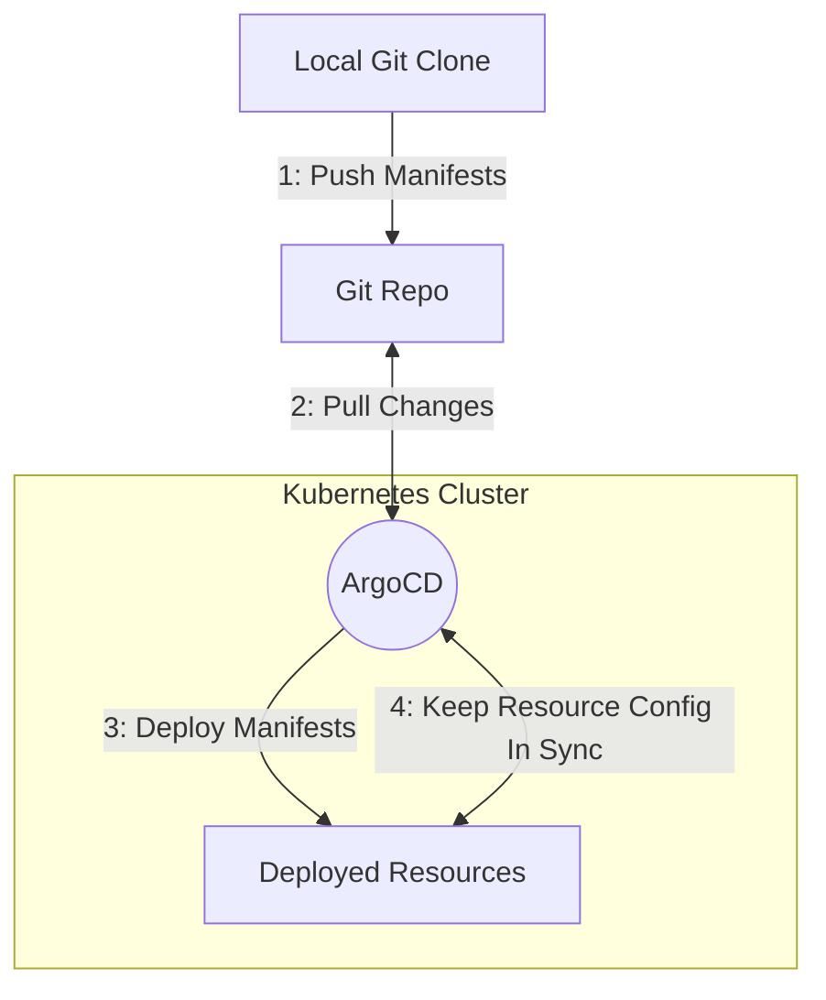
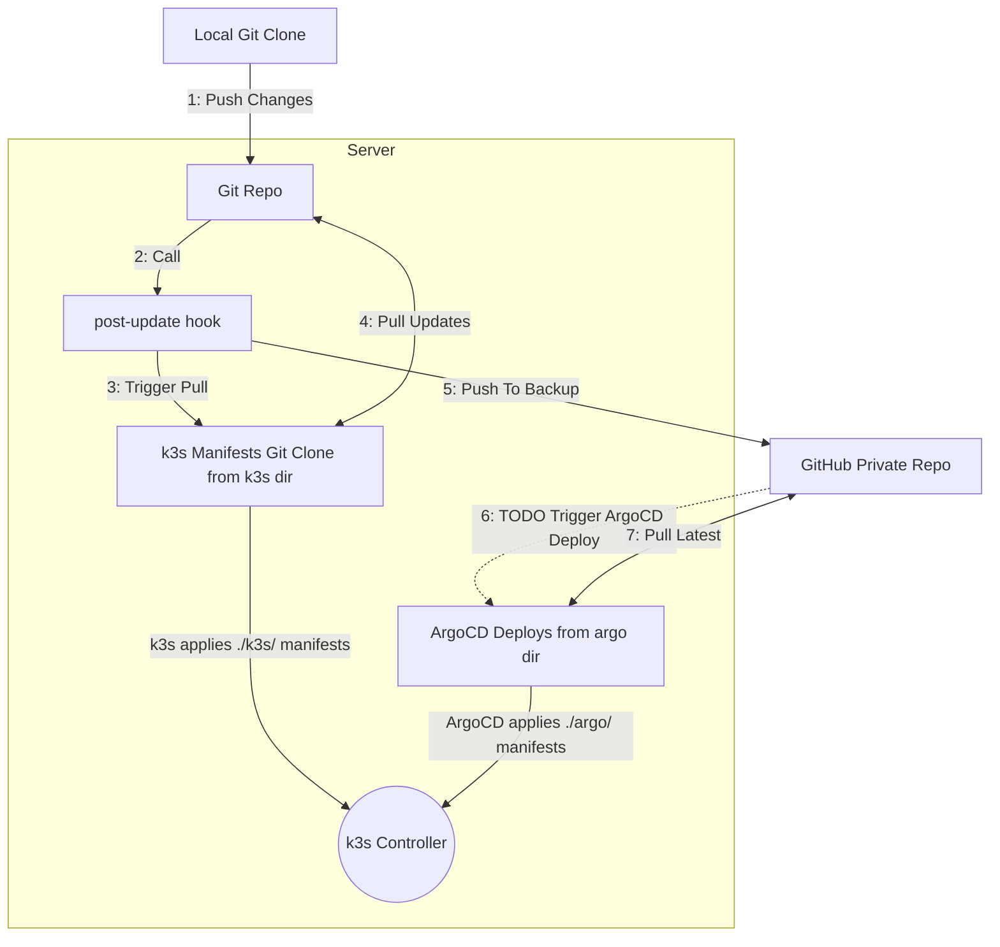

> [!note]
> This post is part of my [[7 Days Of Kubernetes]] where I explore setting up [a cheap MiniPC](https://amzn.to/42tenCq) as a single-node Kubernetes cluster using k3s.

Now that we have some observability set up we can start deploying infrastructure to manage services in our cluster.

The first of these is [ArgoCD](https://argo-cd.readthedocs.io/en/stable/). In short, ArgoCD monitors source repos for manifests to deploy to Kubernetes and ensures that the deployed resources continue to match the manifests as written.



# Deploy the ArgoCD Secret Config

You will need to create and deploy two secrets which various argoCD config options. 

## ArgoCD Server Secret

This is the secret that contains ArgoCD's Server configuration. Here is the template:


```yaml
apiVersion: v1
kind: Secret
metadata:
    name: argocd-secret
    namespace: argocd 
type: Opaque
stringData:
    # TLS certificate and private key for API server (required).
    # Autogenerated with a self-signed certificate when keys are missing or invalid.
    tls.crt: ""
    tls.key: ""
    
    admin.password: TODO: generate
    admin.passwordMtime: TODO: set to today
    server.secretkey:  TODO: generate
    webhook.github.secret:  TODO: generate
```

### Skip the TLS cert and key

The ArgoCD server will auto generate a certificate and key on boot. Our nginx proxy config will not validate the certificate so this is sufficient. 
### Generate the Admin Password

You'll need to generate an admin password. To do this, run this command:

```bash
echo -n "Enter your argo admin password: ";
read -s ARGO_PWD
echo "    admin.password: '$( htpasswd -nbBC 10 "" "$ARGO_PWD" | tr -d ':\n' | sed 's/$2y/$2a/'; )'";
echo "    admin.passwordMtime: $( date -u "%Y-%m-%dT%H:%M:%SZ" )"
```

### Generate the secret key

The secret key is a random 32 bits base64 encoded:

```bash
echo "    admin.secretkey: '$( openssl rand base64 32 )'"
```

### Generate the github webhook secret

The webhook secret is a random password. We can easily generate a secure password with openssl:

```bash
echo "    webhook.github.secret: '$( openssl rand -base64 64 | tr -d '\n/=+' | cut -c -32 )'"
```
## Deploy the github access token secret

The other secret we need to deploy is the github access secret. 

### Secret Format:

```yaml
apiVersion: v1
kind: Secret
metadata:
  name: k3s-manifests-repo-creds
  namespace: argocd  # Or your Argo CD namespace
  labels:
    argocd.argoproj.io/secret-type: repo-creds
stringData:
  type: git
  project: "default"
  url: https://github.com/USERNAME/REPO.git
  username: USERNAME
  password: GITHUB_TOKEN
```

### Update the USERNAME and REPO values

Update the USERNAME and REPO placeholders with your github username and the name of the repo you are storing your manifests in.
### Generate the github token

Go to [github.com -> Settings -> Developer Settings -> Personal Access Tokens -> Fine-Grained Tokens](https://github.com/settings/personal-access-tokens) and create a new fine-grained access token that grants read-only access to the repo that contains your k3s manifests.

Update the `k3s-manifest-repo-creds` secret with the generated token.

# Deploy the ArgoCD Helm Chart

Now that you've deployed the necessary secrets, we can use the [ArgoCD Helm Chart](https://artifacthub.io/packages/helm/argo/argo-cd) to deploy ArgoCD to our k3s cluster:

You will need to edit some pieces of this helm chart. Search for "TODO" in the below YAML and make sure you update these values.


## Replace the domain with your internal domain

There are very places where you will need to update your internal domain.

## Replace the sender email

The given config will use the [[Day 3b - Sending Emails Through Gmail With Postfix Proxy|postfix proxy we previously setup]] to send notification emails when syncs fail. You'll need to update the config so the email is sent from your proxying email address.

## Replace the receiver email

You'll also need to update the email address that emails will be sent to.

## Update the `Application` in `extraManifests`  

The given helm chart config will automatically install a new ArgoCD application. The application will pull from your k3s manifests repo and deploy any manifests in the `argocd` directory of your repo.

## Helm chart contents:

Here's the complete manifest:

```yaml
apiVersion: v1
kind: Namespace
metadata:
  name: argocd
---
apiVersion: helm.cattle.io/v1
kind: HelmChart
metadata:
  name: argocd
  namespace: argocd
spec:
  repo: https://argoproj.github.io/argo-helm
  chart: argo-cd
  version: 7.8.15
  targetNamespace: argocd
  valuesContent: |-
    ## Argo CD configuration
    ## Ref: https://github.com/argoproj/argo-cd
    ##

    # -- Provide a name in place of `argocd`
    nameOverride: argocd
    # -- String to fully override `"argo-cd.fullname"`
    fullnameOverride: "argocd"

    # -- Create cluster roles for cluster-wide installation.
    ## Used when you manage applications in the same cluster where Argo CD runs
    createClusterRoles: true

    ## Custom resource configuration
    crds:
      # -- Install and upgrade CRDs
      install: true
      # -- Keep CRDs on chart uninstall
      keep: true
      # -- Annotations to be added to all CRDs
      annotations: {}
      # -- Addtional labels to be added to all CRDs
      additionalLabels: {}

    ## Globally shared configuration
    global:
      # -- Default domain used by all components
      ## Used for ingresses, certificates, SSO, notifications, etc.
      domain: argocd.internal.example.com # TODO: Update with your internal domain

      # -- Number of old deployment ReplicaSets to retain. The rest will be garbage collected.
      revisionHistoryLimit: 10

      # Default image used by all components
      image:
        # -- If defined, a imagePullPolicy applied to all Argo CD deployments
        imagePullPolicy: IfNotPresent

      # Default logging options used by all components
      logging:
        # -- Set the global logging format. Either: `text` or `json`
        format: text
        # -- Set the global logging level. One of: `debug`, `info`, `warn` or `error`
        level: info

      # -- Add Prometheus scrape annotations to all metrics services. This can be used as an alternative to the ServiceMonitors.
      addPrometheusAnnotations: true

    ## Argo Configs
    configs:
      # General Argo CD configuration. Any values you put under `.configs.cm` are passed to argocd-cm ConfigMap.
      ## Ref: https://github.com/argoproj/argo-cd/blob/master/docs/operator-manual/argocd-cm.yaml
      cm:
        # -- Create the argocd-cm configmap for [declarative setup]
        create: true

        # -- Annotations to be added to argocd-cm configmap
        annotations: {}

        # -- Enable local admin user
        ## Ref: https://argo-cd.readthedocs.io/en/latest/faq/#how-to-disable-admin-user
        admin.enabled: true

        # -- Timeout to discover if a new manifests version got published to the repository
        timeout.reconciliation: 180s

        # -- Timeout to refresh application data as well as target manifests cache
        timeout.hard.reconciliation: 0s

      # Argo CD configuration parameters
      ## Ref: https://github.com/argoproj/argo-cd/blob/master/docs/operator-manual/argocd-cmd-params-cm.yaml
      params:
        # -- Create the argocd-cmd-params-cm configmap
        # If false, it is expected the configmap will be created by something else.
        create: true

        ## Controller Properties
        # -- Number of application status processors
        controller.status.processors: 10
        # -- Number of application operation processors
        controller.operation.processors: 5
        # -- Specifies timeout between application self heal attempts
        controller.self.heal.timeout.seconds: 5
        # -- Repo server RPC call timeout seconds.
        controller.repo.server.timeout.seconds: 60
        # -- Specifies the timeout after which a sync would be terminated. 0 means no timeout
        controller.sync.timeout.seconds: 300

        ## Repo-server properties
        # -- Limit on number of concurrent manifests generate requests. Any value less the 1 means no limit.
        reposerver.parallelism.limit: 10


      # Argo CD sensitive data
      # Ref: https://argo-cd.readthedocs.io/en/stable/operator-manual/user-management/#sensitive-data-and-sso-client-secrets
      secret:
        # -- Bcrypt hashed admin password
        ## Argo expects the password in the secret to be bcrypt hashed. You can create this hash with
        ## `htpasswd -nbBC 10 "" $ARGO_PWD | tr -d ':\n' | sed 's/$2y/$2a/'`
        # TODO: update with your generated password hash
        argocdServerAdminPassword: "$2a$10$8D6wCLuGgMr0FDOkcjSemOdSRh6mSRXN7io6QTu3bJq6EjXp8hYTe"

    ## Redis
    redis:
      # -- Enable redis
      enabled: true

    ## Redis-HA subchart replaces custom redis deployment when `redis-ha.enabled=true`
    # Ref: https://github.com/DandyDeveloper/charts/blob/master/charts/redis-ha/values.yaml
    redis-ha:
      # -- Enables the Redis HA subchart and disables the custom Redis single node deployment
      enabled: false

    redisSecretInit:
      # -- Enable Redis secret initialization. If disabled, secret must be provisioned by alternative methods
      enabled: true
      # -- Redis secret-init name
      name: redis-secret-init

    ## Server
    server:
      # -- Argo CD server name
      name: server

      # TLS certificate configuration via cert-manager
      ## Ref: https://argo-cd.readthedocs.io/en/stable/operator-manual/tls/#tls-certificates-used-by-argocd-server
      certificate:
        # -- Deploy a Certificate resource (requires cert-manager)
        enabled: true
        # -- Certificate primary domain (commonName)
        # @default -- `""` (defaults to global.domain)
        domain: "argocd.internal.example.com" # TODO: upate with your internal domain

        # Certificate issuer
        ## Ref: https://cert-manager.io/docs/concepts/issuer
        issuer:
          # -- Certificate issuer group. Set if using an external issuer. Eg. `cert-manager.io`
          group: "cert-manager.io"
          # -- Certificate issuer kind. Either `Issuer` or `ClusterIssuer`
          kind: "ClusterIssuer"
          # -- Certificate issuer name. Eg. `letsencrypt`
          name: "letsencrypt-cloudflare"

        # Private key of the certificate
        privateKey:
          # -- Rotation policy of private key when certificate is re-issued. Either: `Never` or `Always`
          rotationPolicy: Always
          # -- The private key cryptography standards (PKCS) encoding for private key. Either: `PCKS1` or `PKCS8`
          encoding: PKCS1
          # -- Algorithm used to generate certificate private key. One of: `RSA`, `Ed25519` or `ECDSA`
          algorithm: RSA
          # -- Key bit size of the private key. If algorithm is set to `Ed25519`, size is ignored.
          size: 2048

      # Argo CD server ingress configuration
      ingress:
        # -- Enable an ingress resource for the Argo CD server
        enabled: true
        # -- Specific implementation for ingress controller. One of `generic`, `aws` or `gke`
        ## Additional configuration might be required in related configuration sections
        controller: generic
        # -- Additional ingress labels
        labels: {}
        # -- Additional ingress annotations
        ## Ref: https://argo-cd.readthedocs.io/en/stable/operator-manual/ingress/#option-1-ssl-passthrough
        annotations:
          nginx.ingress.kubernetes.io/ssl-passthrough: "true"
          nginx.ingress.kubernetes.io/backend-protocol: "HTTPS"

        # -- Defines which ingress controller will implement the resource
        ingressClassName: "internal"

        # -- Argo CD server hostname
        # @default -- `""` (defaults to global.domain)
        hostname: "argocd.internal.example.com" # TODO: update with your internal domain

    ## Repo Server
    repoServer:
      # -- Repo server name
      name: repo-server

      # -- The number of repo server pods to run
      replicas: 1

    ## ApplicationSet controller
    applicationSet:
      # -- ApplicationSet controller name string
      name: applicationset-controller
      # -- The number of ApplicationSet controller pods to run
      replicas: 0

    ## Notifications controller
    notifications:
      # -- Enable notifications controller
      enabled: true

      # -- Configures notification services such as slack, email or custom webhook
      # @default -- See [values.yaml]
      ## For more information: https://argo-cd.readthedocs.io/en/stable/operator-manual/notifications/services/overview/
      notifiers: 
        service.email.gmail: |
          host: mail.mail
          port: 25
          from: "ArgoCD <example@gmail.com>" # TODO: Put in your sending email address instead

      # -- Contains centrally managed global application subscriptions
      ## For more information: https://argo-cd.readthedocs.io/en/stable/operator-manual/notifications/subscriptions/
      subscriptions:
        # subscription for on-sync-status-unknown trigger notifications
        - recipients:
          - email:youruser@gmail.com # TODO: replace with your receiving email
          triggers:
          - on-sync-status-unknown
          - on-sync-status-failed
          - on-health-degraded

      # -- The trigger defines the condition when the notification should be sent
      ## For more information: https://argo-cd.readthedocs.io/en/stable/operator-manual/notifications/triggers/
      triggers:
        trigger.on-health-degraded: |
          - description: Application has degraded
            send:
            - app-health-degraded
            when: app.status.health.status == 'Degraded'
        trigger.on-sync-failed: |
          - description: Application syncing has failed
            send:
            - app-sync-failed
            when: app.status.operationState.phase in ['Error', 'Failed']
        trigger.on-sync-status-unknown: |
          - description: Application status is 'Unknown'
            send:
            - app-sync-status-unknown
            when: app.status.sync.status == 'Unknown'

        defaultTriggers: |
          - on-sync-status-unknown
          - on-sync-status-failed
          - on-health-degraded

    commitServer:
      # -- Enable commit server
      enabled: false

    extraObjects:
    - apiVersion: argoproj.io/v1alpha1
      kind: Application
      metadata:
        name: base-argo-deploy
        namespace: argocd
      spec:
        destination:
          namespace: argocd-deploys
          server: https://kubernetes.default.svc
        project: default
        source:
          directory:
            jsonnet: {}
            recurse: true
          # TODO: update the repo options below:
          repoURL: 'https://github.com/USERNAME/REPO.git'
          targetRevision: master
          path: 'argocd/'
        syncPolicy:
          retry:
            limit: 1
          automated:
            prune: true
            selfHeal: true
          syncOptions:
          - CreateNamespace=true

```

# Next Steps

Now that we have ArgoCD deployed to your cluster we can start placing manifests in the `argocd` directory of our k3s manifests repo to have them be deployed.

The new code flow looks like this:



While this looks complicated, it's easy to keep in mind that we have two ways manifests can get into our k3s cluster: the `k3s` directory and the `argo` directory.

We can now migrate our manifests from the k3s directory and into the argo directory. This will get us self-healing, automatic pruning, and better lifecycle management of the resources defined in our manifests.

But first, we need to get the github webhook set up so that pushes to our github repo will instantly trigger our argo deploys. [[Day 4b - ArgoCD triggered by GitHub webhook|Read on in the next article for how we did that!]]