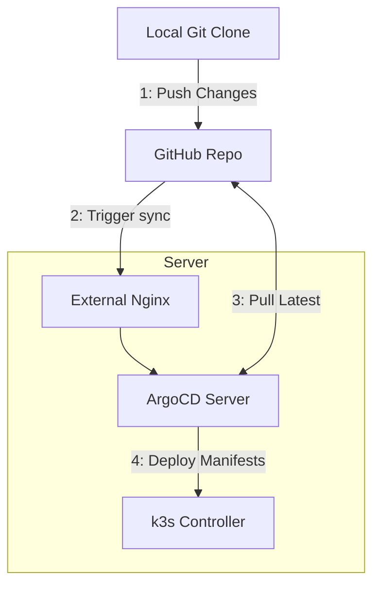

> [!note]
> This post is part of my [[7 Days Of Kubernetes]] where I explore setting up [a cheap MiniPC](https://amzn.to/42tenCq) as a single-node Kubernetes cluster using k3s.

Now that [[Day 4a - Deploy ArgoCD|we have ArgoCD set up]] and deploying manifests, we want to configure a webhook in github so that when we push to our manifests repo it will trigger ArgoCD to do a deploy.



# Update The ArgoCD Helm Chart

When we [[Day 4a - Deploy ArgoCD|deployed argocd]] we already set up the github webhook secret, so we're most of the way there. 

If you went through the entire values file for [the argocd helm chart](https://artifacthub.io/packages/helm/argo/argo-cd) you may have seen references to a "[Git generator webhook](https://argocd-applicationset.readthedocs.io/en/master/Generators-Git/#webhook-configuration)" and assumed that was the webhook you wanted--but it's not!

The "git generator webhook" is for the ApplicationSet controller which we're not using. Instead, you want to create the ArgoCD Server webhook, which is at the `/api/webhook` endpoint on the ArgoCD server.

To support this, we'll deploy an additional manifest which configures an ingress only for the webhook path and use [[Day 2a - Ingress with Nginx and Cert-Manager|our external nginx deployment]] to route the traffic to ArgoCD.

## Create the ingress

To do this, we'll add a manifest to the `extraObjects` config of our values file for argocd. In the codeblock below I removed the `Application` object and just included the Ingress object. 

Make sure to update the `host:` indicated by the TODO comment!

```yaml
    extraObjects:
    - ... additional object here for an ArgoCD Application ...

    - apiVersion: networking.k8s.io/v1
      kind: Ingress
      metadata:
        annotations:
          nginx.ingress.kubernetes.io/backend-protocol: HTTPS
          nginx.ingress.kubernetes.io/ssl-passthrough: "true"
        name: argocd-git-hook
        namespace: argocd
      spec:
        ingressClassName: external
        rules:
        - host: argocd-git.external.example.com # TODO: update this hostname
          http:
            paths:
            - backend:
                service:
                  name: argocd-server
                  port:
                    number: 443
              path: /api/webhook
              pathType: Prefix
```

# Configure GitHub

Once the ingress is deployed, we can now update our github repo to call the webhook. 

Go to the repo in github and click on the "Settings" button in the top section then select Webhooks.

![[Screenshot 2025-04-09 at 10.37.39 PM.png]]

In the webhooks section, click on "Add Webhook".

Fill out the form with the endpoint for your ingress and the webhook secret you generated previously.


> [!important]
> Make sure you set the content type to Application/JSON or it won't work!


![[Screenshot 2025-04-09 at 10.40.33 PM.png]]


# Test The Hook

To test the hook you can push a change to your repo and ArgoCD should deploy it right away. To double-check if it's working, click into the webhook and look at the "Recent Deliveries" tab to see if it was successfully delivered:

![[Screenshot 2025-04-09 at 10.45.04 PM.png]]

If you click the 3-dots button next to a failed delivery, you can see details on the deliver and, more importantly, you can hit the `Redeliver` button to retry that delivery without needing to push a bunch of empty commits.


# Next Steps

Now that we have github hooked up to ArgoCD we can quickly iterate on deploys. There's just one nagging problem: we're still managing secrets on the server itself rather than being able to edit them in code.

In the next post we'll look at [[Day 4c - Configuring Git Secrets|setting up transcrypt]] so we can securely store our git secrets in my k3s manifests repo.