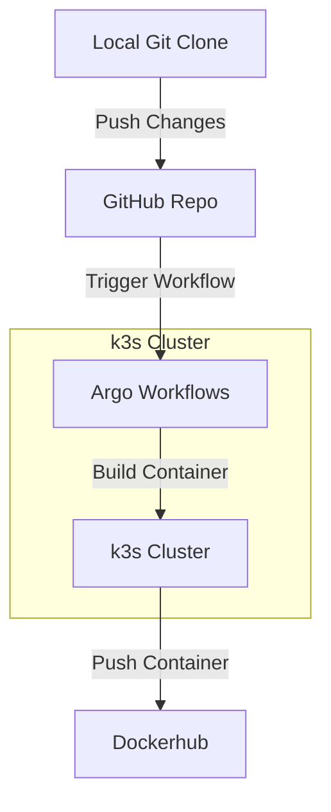

> [!note]
> This post is part of my [[7 Days Of Kubernetes]] where I explore setting up [a cheap MiniPC](https://amzn.to/42tenCq) as a single-node Kubernetes cluster using k3s.


In day 6, we [[Day 6 - Using Argo Workflows to Build a Docker Image on k3s|set up Argo Workflows to build a docker image]]. Now that we have that working our next step is to get this workflow to run automatically whenever we push to github.



# Set up Argo Workflows

The first step is to deploy the necessary resources for argo-workflows to be able to run jobs from github. This includes:

- A namespace to run the jobs
- A service account to act on behalf of github
- Permissions for the service account
- Permissions for Argo Workflow Server to access that service account
- And an ingress to route traffic to the argo workflow server

The manifests you need look like the below. Notice that they go under the `extraManifests` key in the argo-workflows helm chart:

```yaml
extraObjects:
    # Create the namespace
  - kind: Namespace
    apiVersion: v1
    metadata:
      name: argo-workflow-jobs

    # Create a user that will be acting when github hits the webhook
  - apiVersion: v1
    kind: ServiceAccount
    metadata:
      name: github-webhook
      namespace: argo-workflow-jobs
      annotations:
        # Tells to the Argo Server which secret holds this service account's token
        workflows.argoproj.io/service-account-token.name: github-webhook

    # Create a service account token for the github user
  - apiVersion: v1
    kind: Secret
    type: kubernetes.io/service-account-token
    metadata:
      name: github-webhook
      namespace: argo-workflow-jobs
      annotations:
        kubernetes.io/service-account.name: github-webhook

    # Create a role which grants permission to trigger a workflow
  - apiVersion: rbac.authorization.k8s.io/v1
    kind: Role
    metadata:
      name: submit-workflow-template
      namespace: argo-workflow-jobs
    rules:
      - apiGroups:
          - argoproj.io
        resources:
          - workfloweventbindings
        verbs:
          - list
      - apiGroups:
          - argoproj.io
        resources:
          - workflowtemplates
        verbs:
          - get
      - apiGroups:
          - argoproj.io
        resources:
          - workflows
        verbs:
          - create

    # Create a rolebinding to grant the role to the github user
  - apiVersion: rbac.authorization.k8s.io/v1
    kind: RoleBinding
    metadata:
      name: github-webhook
      namespace: argo-workflow-jobs
    roleRef:
      apiGroup: rbac.authorization.k8s.io
      kind: Role
      name: submit-workflow-template
    subjects:
      - kind: ServiceAccount
        name: github-webhook
        namespace: argo-workflow-jobs

    # Create a role to allow  access the github user
  - apiVersion: rbac.authorization.k8s.io/v1
    kind: Role
    metadata:
      name: argo-workflows-server-webhook
      namespace: argo-workflow-jobs
    rules:
      - apiGroups:
          - '*'
        resources:
          - serviceaccounts
        verbs:
          - list
          - get

    # Allow the argo workflow server to access the github user
  - apiVersion: rbac.authorization.k8s.io/v1
    kind: RoleBinding
    metadata:
      name: argo-workflows-server-webhook
      namespace: argo-workflow-jobs
    roleRef:
      apiGroup: rbac.authorization.k8s.io
      kind: Role
      name: argo-workflows-server-webhook
    subjects:
      - kind: ServiceAccount
        name: argo-workflows-server
        namespace: argo-workflows

    # Set up an ingress to allow traffic to hit the events API
  - apiVersion: networking.k8s.io/v1
    kind: Ingress
    metadata:
      name: argo-workflows-git-hook
      namespace: argo-workflows
    spec:
      ingressClassName: external
      rules:
        - host: argo-workflows.example.com
          http:
            paths:
              - backend:
                  service:
                    name: argo-workflows-server
                    port:
                      number: 2746
                path: /api/v1/events/argo-workflow-jobs/
                pathType: Prefix
```

Make sure you update the `host` field in the ingress to match your publically accessible domain!

The one final resource we must create is a secret that will hold the signing token used by github. We want to set this up so that only services with the token will be able to trigger workflows.

```yaml
apiVersion: v1
kind: Secret
metadata:
  name: argo-workflows-webhook-clients
  namespace: argo-workflow-jobs
stringData:
  # The key in the secret must match the name of the service account we want to bind to this webhook
  # The secret holds the credentials that are used for the signature of the webhook. The Argo Server also uses this signature to determine which secret key to look for.
  github-webhook: |
    type: github
    secret: "YOUR SECRET TOKEN GOES HERE"
```

In the above secret, the `github-webhook` key must match the name of the service account you create. Also make sure to change the `secret` value to an actual secret.


> [!tip] Generate a Secret
> You can quickly generate a secret using this shell script:
> 
> ```bash
> openssl rand -base64 48
> ```


# Configure Github

Now that you have everything deployed you're ready to setup github!

I've already written about how to do that in [[Day 4b - ArgoCD triggered by GitHub webhook#Configure GitHub]]. 

When configuring the webhook secret in github use the secret you provided in the `argo-workflows-webhook-clients` kubernetes secret.

For your URL, the last bit of the URL is the `discriminator` that is used to indicate to Argo Workflows which WorkflowEventBinding this webhook belongs to.

For example:
```text
https://argo-workflows.example.com/api/v1/events/argo-workflow-jobs/github-webhook
```

In this case, the discriminator would be `github-webhook` 

# Deploy Your WorkflowEventBinding

With the hook setup we can now deploy the WorkflowEventBinding. For the simplest use case, we can have our Workflow run whenever the webhook is fired:

```yaml
apiVersion: argoproj.io/v1alpha1
kind: WorkflowEventBinding
metadata:
  name: github-push-webhook
  namespace: argo-workflow-jobs
spec:
  event:
    selector: discriminator == "github-webhook" && metadata["x-github-event"] == ["push"]
  submit:
    workflowTemplateRef:
      name: docker-build
```

If you deploy that binding and then trigger the webhook you should see your `docker-build` workflow template get triggered!

# Add Dynamic Repos

It would be cool if we could use the same WorkflowEventBinding and use the same webhook config on each of our github repos. This would allow us to easily add automatic builds to any of our github repos.

To do this, we can use parameters that source from the payload:

```yaml
apiVersion: argoproj.io/v1alpha1
kind: WorkflowEventBinding
metadata:
  name: github-push-webhook
  namespace: argo-workflow-jobs
spec:
  event:
    selector: discriminator == "github-webhook" && metadata["x-github-event"] == ["push"]
  submit:
    workflowTemplateRef:
      name: docker-build
    arguments:
      parameters:
        - name: repo
          valueFrom:
            event: payload.repository.ssh_url
```

By adding the repo parameter, we now can have our workflow template build a different workflow for different repos!

# Add Custom URL Parameters

One final thing I wanted was to be able to specify which Dockerfile to use rather than alway defaulting to `./Dockerifle`. To do this I determined that using URL GET Parameters was a good solution.

To do this, we'll update our webhook URL to include the paramter:

```text
https://argo-workflows.example.com/api/v1/events/argo-workflow-jobs/github-webhook?dockerfile=./path/to/dockerfile
```

We then need to expose that parameter to argo workflows. I discovered that argo will expose any Headers that start with `x-`, so we can use nginx to add that header.

To do this, add the following annotation to your ingress:

```yaml
annotations:
  nginx.ingress.kubernetes.io/configuration-snippet: |
    proxy_set_header x-dockerfile $arg_dockerfile;
```

The magic in here is the `$arg_dockerfile` argument. This tells nginx to take the `dockerfile` URL parameter and put it in the `x-dockerfile` header BEFORE the request is proxied to Argo Workflows.

Now we update our WorkflowEventBinding to use the new header:

```yaml
spec:
  submit:
    arguments:
      parameters:
        - name: dockerfile
          valueFrom:
            event: >-
              (
                metadata["x-dockerfile"] == nil ||
                len(metadata["x-dockerfile"]) == 0 
              ) ? "./Dockerfile" : metadata["x-dockerfile"][0]
```

This will set the `dockerfile` argument to whatever you put in the `dockerfile` URL parameter and default to `./Dockerfile` if the parameter is not set!
