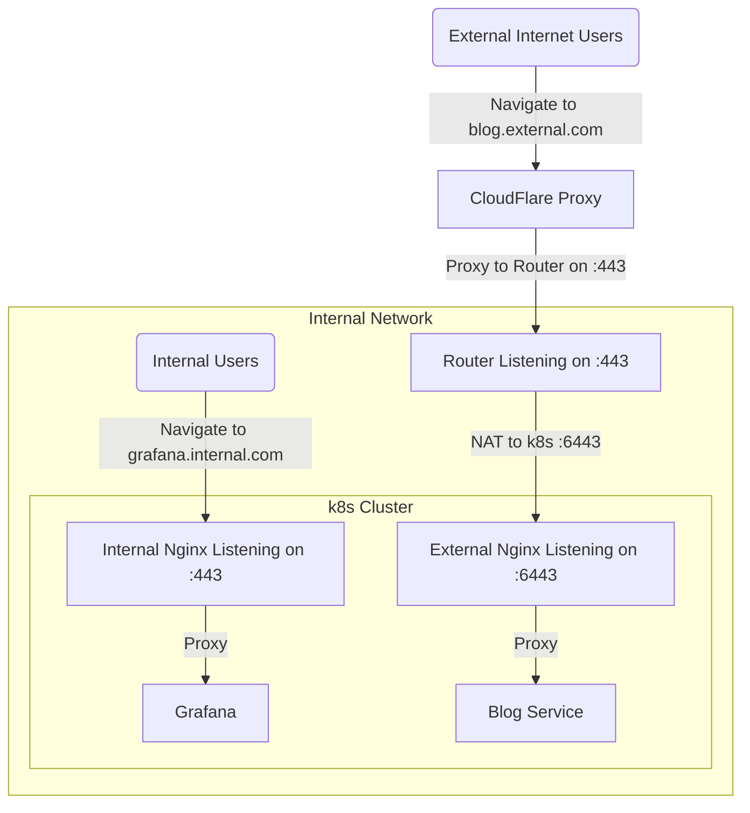

---
tags:
  - kubernetes
  - networking
  - k3s
  - security
  - devops
  - scripts
---
*(This post is part of my [[7 Days Of Kubernetes]] where I explore setting up [a cheap MiniPC](https://amzn.to/42tenCq) as a single-node Kubernetes cluster using k3s.)*

So far we've set up our k3s cluster ([[Day 1a - Setting Up k3s]]) and configured git-based manifest management ([[Day 1b - Deploying Manifests to K3s]]). 


# Prep Work

For this guide, I will assume that you have a Cloudflare account and have set up your DNS to point at your server.

You should have two domains, one for internal-only and one for external-only. For your internal-only records, point them at the LAN IP of your server. For the external-only, point them at the public IP of your server.

You can get the public IP of your server using `ifconfig.me`:

```bash
curl https://ifconfig.me
```

Your records will look something like this:

| Use      | Record                   | IP              |
| -------- | ------------------------ | --------------- |
| Internal | `*.internal-example.com` | 192.168.0.23    |
| Internal | `internal-example.com`   | 192.168.0.23    |
| External | `*.external-example.com` | 142.251.183.138 |
| External | `external-example.com`   | 142.251.183.138 |

# Setting up Ingress-Nginx

Before we can deploy any services like Grafana or argo-cd, we need to set up the ability to route traffic into our node. 

In the interest of security, we're going to be operating with two domains:
1. An "internal-only" domain which resolves to the LAN-only RFC-1918 IP our k8s cluster.
2. An "external-only" domain which resolves to the WAN IP of our router.

*You could achieve the same thing with an `internal` subdomain on your main domain (e.g.: `internal.example.com`)*

Thus, our plan will look something like this:



Later on we can install [tailscale](https://tailscale.com/) on our server to allow us to access our internal pages from anywhere, but, for now, we're focusing on nginx.

## Cleaning up k3s's traefik

We're using [k3s helm chart support](https://docs.k3s.io/helm) for this so the process is easy. However, k3s ships with traefik by default so we first must disable that.

```bash
# Delete the config file
rm -v /var/lib/rancher/k3s/server/manifests/traefik.yaml

# Delete the resrouces
kubectl -n kube-system delete all -l app.kubernetes.io/instance=traefik

# delete the helm chart
kubectl -n kube-system delete helmcharts.helm.cattle.io traefik traefik-crd

kubectl delete addons.k3s.cattle.io -n kube-system traefik
```


## Deploy the Ingress-Nginx Helm Chart

### A warning on naming

Not that there are two ways to do nginx in kuberntes: `ingress-nginx` and `nginx-ingress`. 

`ingress-nginx` is [the kubernetes-maintained helm chart for nginx](https://artifacthub.io/packages/helm/ingress-nginx/ingress-nginx)
`nginx-ingress` is [the nginx-maintained helm chart for nginx](https://artifacthub.io/packages/helm/nginx/nginx-ingress)

I suggest using `ingress-nginx` as most documentation you find online will be for that helm chart. (Including this document!)

### Populating the Base Template

To deploy a helm chart we start with the base template:

```yaml
apiVersion: v1
kind: Namespace
metadata:
  name: <namespace>
---
apiVersion: helm.cattle.io/v1
kind: HelmChart
metadata:
  name: <chart deployed name>
  namespace: <namespace>
spec:
  repo: <repo URL for helm chart>
  chart: <chart name in repo>
  version: <chart version in repo>
  targetNamespace: <namespace>
  valuesContent: |-
	  <content of values.yaml>
```

To get most these values, I prefer to use ArtifactHub as they have an easy interface for figuring this out.

![[Screenshot 2025-04-05 at 9.50.51 AM.png|Artifact hub makes it easy to get the config options for a helm chart using the Install and Default Values buttons.]]


First we click the `Install` button to get the repo path and current version:

![[Screenshot 2025-04-05 at 9.51.16 AM.png|The install popover shows us the repo, chart name, and latest version]]

```yaml
apiVersion: v1
kind: Namespace
metadata:
  name: nginx-internal
---
apiVersion: helm.cattle.io/v1
kind: HelmChart
metadata:
  name: nginx
  namespace: nginx-internal
spec:
  repo: https://kubernetes.github.io/ingress-nginx
  chart: ingress-nginx
  version: 4.12.1
  targetNamespace: nginx-internal
  valuesContent: |-
	  <content of values.yaml>
```

Wke e can then click on the `Default Values` button and copy that entire blob into the `valuesContent` key:

![[Screenshot 2025-04-05 at 9.51.39 AM.png|Copy the entire content using this button]]

Make sure that you indent the YAML values correctly so they are parsed as a string under the valuesContent key.

### Automating the fetch process

I wrote this simple shell script which will automate the above process given an artifacthub url. 

Usage is like:

```bash
bash ./generate_helmchart_manifest.sh -c nginx -n nginx-internal https://artifacthub.io/packages/helm/ingress-nginx/ingress-nginx
```

Here is the script:
```bash
#!/usr/bin/env bash

set -eEuo pipefail

namespace=""

while getopts "c:n:h" opt; do
  case $opt in
  n) namespace="$OPTARG" ;;
  c) NAME="$OPTARG" ;;
  h)
    {
      echo "Generates a k3s addon helm chart manifest from artifacthub."
      echo
      echo "$0 [-c name] [-n namespace] <artifacthub_url_for_helmchart>"
      echo
      echo "Namespace defaults to the name of the helm chart, use -n to override"
      echo
      echo "Name is the name of the deployed chart. defaults to the name of the helm chart, use -c or \$NAME to override"
      echo
      echo "$0 -c nginx -n nginx-internal https://artifacthub.io/packages/helm/ingress-nginx/ingress-nginx"
    } >&2
    exit 1
    ;;
  \?)
    echo "Invalid option: -$OPTARG" >&2
    exit 1
    ;;
  :)
    echo "Option -$OPTARG requires an argument." >&2
    exit 1
    ;;
  esac
done

shift $((OPTIND - 1))

artifacthub_url="${1:?You must pass in a URL to to a helm chart on artifacthub.io}"

artifacthub_regex='artifacthub.io/(packages/helm/.+)'
if ! [[ "$artifacthub_url" =~ $artifacthub_regex ]]; then
  >&2 echo "Given url does not match regex: $artifacthub_regex"
  exi 1
fi

# Switch the URL to the api endpoint
api_url="https://artifacthub.io/api/v1/${BASH_REMATCH[1]}"
artifacthub_json=$(curl --location --fail --silent "$api_url")

name=$(jq -e -r '.name' <<<"$artifacthub_json")
version=$(jq -e -r '.version' <<<"$artifacthub_json")
repository_url=$(jq -e -r '.repository.url' <<<"$artifacthub_json")
values=$(helm show values --repo "$repository_url" "$name" --version="$version")

if [[ -z $namespace ]]; then
  namespace="$name"
fi

cat <<EOYAML
apiVersion: v1
kind: Namespace
metadata:
  name: $namespace
---
apiVersion: helm.cattle.io/v1
kind: HelmChart
metadata:
  name: '${NAME:-$name}'
  namespace: $namespace
spec:
  repo: '$repository_url'
  chart: '$name'
  version: '$version'
  targetNamespace: '$namespace'
  valuesContent: |-
$(echo "$values" | sed 's/^/    /')
EOYAML

```
## Values to Set On the Helm Chart

I generally paste in the entire values file, then edit out the bits that I don't want. This has the unfortunate side-effect of not leaving a clear trail on what is essential and what is default.

That being said, below are some values you might consider configuring:
### Values for Nginx-Internal

```yaml
apiVersion: v1
kind: Namespace
metadata:
  name: nginx-internal
---
apiVersion: helm.cattle.io/v1
kind: HelmChart
metadata:
  name: 'nginx'
  namespace: nginx-internal
spec:
  repo: 'https://kubernetes.github.io/ingress-nginx'
  chart: 'ingress-nginx'
  version: '4.12.1'
  targetNamespace: 'nginx-internal'
  valuesContent: |-
    nameOverride: ingress-nginx-internal
    fullnameOverride: ingress-nginx-internal
    controller:
      # Ensure that our internal nginx is listening on 80 and 443
      containerPort:
        http: 80
        https: 443

      # Later when we get to arg-workflows we will need support for 
      # config snippets in annotations. We will turn those on now.
      # See: https://github.com/kubernetes/ingress-nginx/blob/main/docs/user-guide/nginx-configuration/annotations.md#configuration-snippet
      allowSnippetAnnotations: true
      config:
        # We will set up cert-manager, so we wnat to force http -> https redirects
        force-ssl-redirect: "true"
        # See comment on allowSnippertAnnotations
        annotations-risk-level: "Critical"

      # Set up the ingress class with name internal
      ingressClassResource:
        enabled: true
        name: internal
        # Default the internal ingress class to true
        # This is a "secure by default" choice where we will need to opt-in to 
        # using the public nginx ingress
        default: true

      ingressClass: internal
      extraArgs:
        # We will set up this certificate in the next step
        default-ssl-certificate: "nginx-internal/default-tls"
```

### Values for nginx-external

For nginx-external, we can do a lot of the same config options but switch the ports and names to be "external". 

Note also that we set the ingressClassResult to default=false.

```yaml
apiVersion: v1
kind: Namespace
metadata:
  name: nginx-external
---
apiVersion: helm.cattle.io/v1
kind: HelmChart
metadata:
  name: 'nginx'
  namespace: nginx-external
spec:
  repo: 'https://kubernetes.github.io/ingress-nginx'
  chart: 'ingress-nginx'
  version: '4.12.1'
  targetNamespace: 'nginx-external'
  valuesContent: |-
    nameOverride: ingress-nginx-external
    fullnameOverride: ingress-nginx-external
    controller:
      # We expose our external ingress on 61080 and 61443
      # Then we will use NAT at the router level to remap
      # WAN requests on port 80 and 443 to these two ports
      containerPort:
        http: 61080
        https: 61443

      # Later when we get to argo-workflows we will need support for 
      # config snippets in annotations. We will turn those on now.
      # See: https://github.com/kubernetes/ingress-nginx/blob/main/docs/user-guide/nginx-configuration/annotations.md#configuration-snippet
      allowSnippetAnnotations: true
      config:
        # We will set up cert-manager, so we wnat to force http -> https redirects
        force-ssl-redirect: "true"
        # See comment on allowSnippertAnnotations
        annotations-risk-level: "Critical"

      # Set up the ingress class with name external
      ingressClassResource:
        enabled: true
        name: external
        # Do not default to use the external ingress class
        default: false

      ingressClass: external
      extraArgs:
        # We will set up this certificate in the next step
        default-ssl-certificate: "nginx-external/default-tls"
```
### Configure your router to NAT for nginx-external

You'll want to log into your router and looking for `NAT` or `port-forwarding` options and configure your router to forward port 80 to internal port 61080. Do the same for port 443 mapping to internal port 61443.

At the same time, you should probably reserve the DHCP address for your server so that the port forwarding doesn't break.

# Setting Up Cert-Manager

Now that we have our nginx-ingress configurations set up, we can move onto configuring cert-manager. We'll follow the same process as nginx: [use the cert-manager helm chart from artifacthub](https://artifacthub.io/packages/helm/cert-manager/cert-manager) to deploy this service.

## What is cert-manager?

Cert-manager provides an easy way for your k8s-based endpoints ("Ingresses") to be secured with certificates signed by a certificate authority. This will get you HTTPS support which is required for the `.dev` domain but generally a good idea to always enable.

In our case, we will be using CloudFlare DNS-based certificate issuance from Let's Encrypt. This lets us get valid certificates for all of our services: even the services that are only accessible inside our LAN!

## Deploying Cert-Manager

### Deploy Our cert-manager Helm Chart

The below manifest is all we need to install cert-manager:

```yaml
apiVersion: v1
kind: Namespace
metadata:
  name: cert-manager
---
apiVersion: helm.cattle.io/v1
kind: HelmChart
metadata:
  name: cert-manager
  namespace: cert-manager
spec:
  repo: https://charts.jetstack.io
  chart: cert-manager
  version: 1.17.1
  targetNamespace: cert-manager
  valuesContent: |-
    crds:
      enabled: true
```

Pretty simple! The real magic comes in the form of ClusterIssuers and Certificates.

### Deploy ClusterIssuers

ClusterIssuers are the way we tell cert-manger how to fetch certificates. In our case, we're using Cloudflare to issue certificates so we need to tell cert-manager how to talk to Cloudflare.

```yaml
apiVersion: cert-manager.io/v1
kind: ClusterIssuer
metadata:
  name: letsencrypt-cloudflare
  namespace: cert-manager
spec:
  acme:
    server: https://acme-v02.api.letsencrypt.org/directory
    email: <YOUR CLOUDFLARE EMAIL>
    privateKeySecretRef:
      name: letsencrypt-cloudflare-private-key
    solvers:
    - dns01:
        cloudflare:
          email: <YOUR CLOUDFLARE EMAIL>
          apiTokenSecretRef:
            name: cloudflare-api-token
            key: api-token
```

This manifest tells cert-manager to use DNS-based issuance using Cloudflare. Note the `apiTokenSecretRef` stanza: we need to create an access token [in the Cloudflare dashboard](https://dash.cloudflare.com/profile/api-tokens) (under Profile -> API Tokens).

Once you have your API token, add it as a secret in the k3s manifests directory:

```yaml
apiVersion: v1
kind: Secret
metadata:
  name: cloudflare-api-token
  namespace: cert-manager
type: Opaque
stringData:
  api-token: <API TOKEN GOES HERE>
```

Or create it directly:

```bash
kubectl create secret -n cert-manager cloudflare-api-token --from-literal=api-token="<API_TOKEN_GOES_HERE>"
```

Once you have your secret and ClusterIssuer deployed, we can deploy the default-tls secrets for our ingress-nginx deployments.

### Deploy Certificates

The below manifests will create two certificates using our new ClusterIssuers. 

One benefit of using DNS-based validation is that we can issue certificates for wildcard domains. This makes it easy to be default-secure without needing to issue a new certificate for every new service you add.

**Make sure you edit the `dnsNames` field in the below manifests.**

```yaml
apiVersion: cert-manager.io/v1
kind: Certificate
metadata:
  namespace: nginx-internal
  name: default-tls
spec:
  dnsNames:
  - '*.<YOUR_INTERNAL_ONLY_DOMAIN>.com'
  issuerRef:
    group: cert-manager.io
    kind: ClusterIssuer
    name: letsencrypt-cloudflare
  secretName: default-tls
  usages:
  - digital signature
  - key encipherment
---
apiVersion: cert-manager.io/v1
kind: Certificate
metadata:
  namespace: nginx-external
  name: default-tls
spec:
  dnsNames:
  - '*.<YOUR_EXTERNAL_DOMAIN>.com'
  issuerRef:
    group: cert-manager.io
    kind: ClusterIssuer
    name: letsencrypt-cloudflare
  secretName: default-tls
  usages:
  - digital signature
  - key encipherment
```

Once you deploy the certificate manifests, you can watch the cert-manager for any errors during the deploy process:

```bash
kubectl logs -f -n cert-manager svc/cert-manager
```

Or you can look at the Certificate resources to see if they get deployed:

```bash
> kubectl get certificates -A | grep nginx
nginx-external   default-tls                        True    default-tls                            4m12s
nginx-internal   default-tls                        True    default-tls                            3m20s
```

# Testing It All

We did it! We should now have Let's Encrypted certificates in front of our endpoints! You can test this by navigating to your domain in your browser or you can use this openssl command:

```bash
openssl s_client -connect example.yourdomain.com:443 -showcerts </dev/null | openssl x509 -noout -subject
```

# Future Work

## Setup Tailscale

You can set up [Tailscale](https://tailscale.com/) on your server so that you can access your internal services from anywhere. If you do this, on your server you'll need to "advertise-routes" to allow your traffic to reach the node:

```bash
tailscale up --advertise-routes=192.168.0.0/24
```

When I did this, I set my router's internal subnet CIDR to an arbitrarily high octet (e.g.: `192.168.210.0/24`) so that there is less risk of it conflicting with other WiFi networks I connect to.

## Enable Cloudflare Proxying

Cloudflare will proxy and CDN traffic for free. You can turn this on in the Cloudflare settings. 
If you do this, make sure you set your "SSL/TLS Encryption Mode" to "Full" or you will get infinite redirect loops when you visit your site.

![[Screenshot 2025-04-05 at 4.46.49 PM.png]]

The SSL encryption options are in the Cloudflare dashboard -> Your Domain -> SSL/TLS

![[Screenshot 2025-04-05 at 4.43.55 PM.png|Ensure your encryption mode for Cloudflare is set to Full or you'll get infinite redirection loops.]]